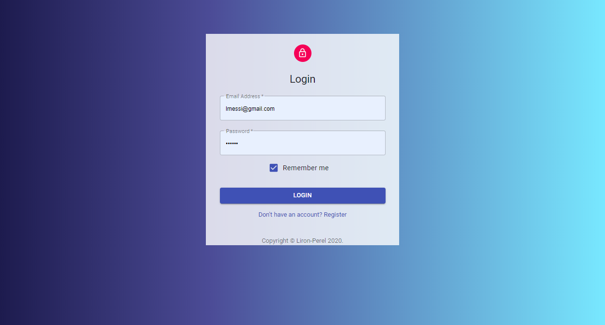
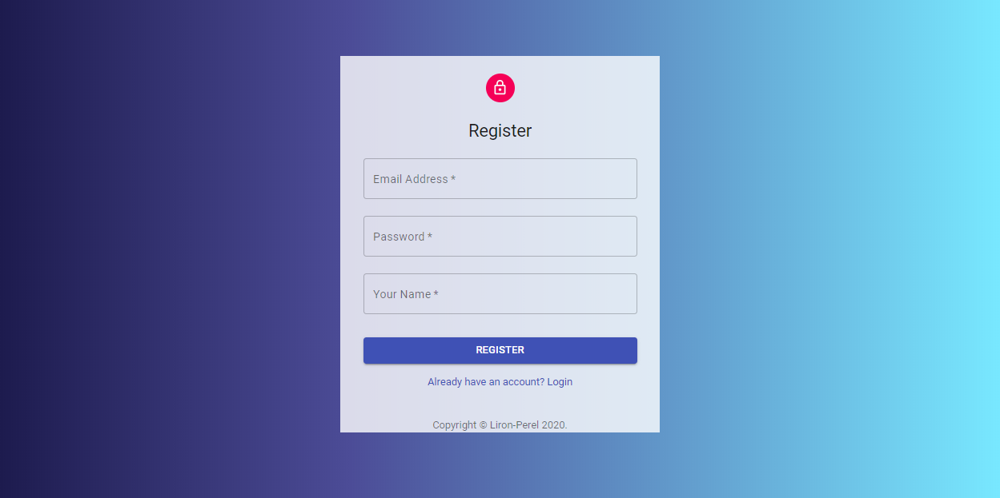
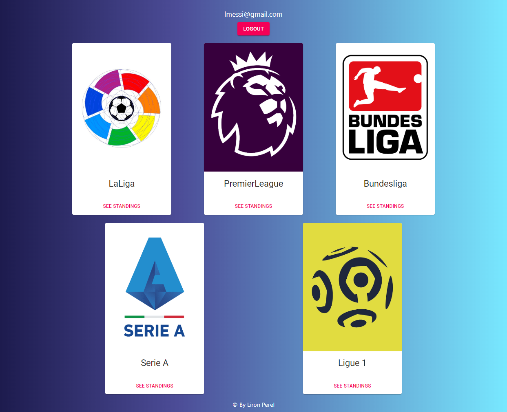
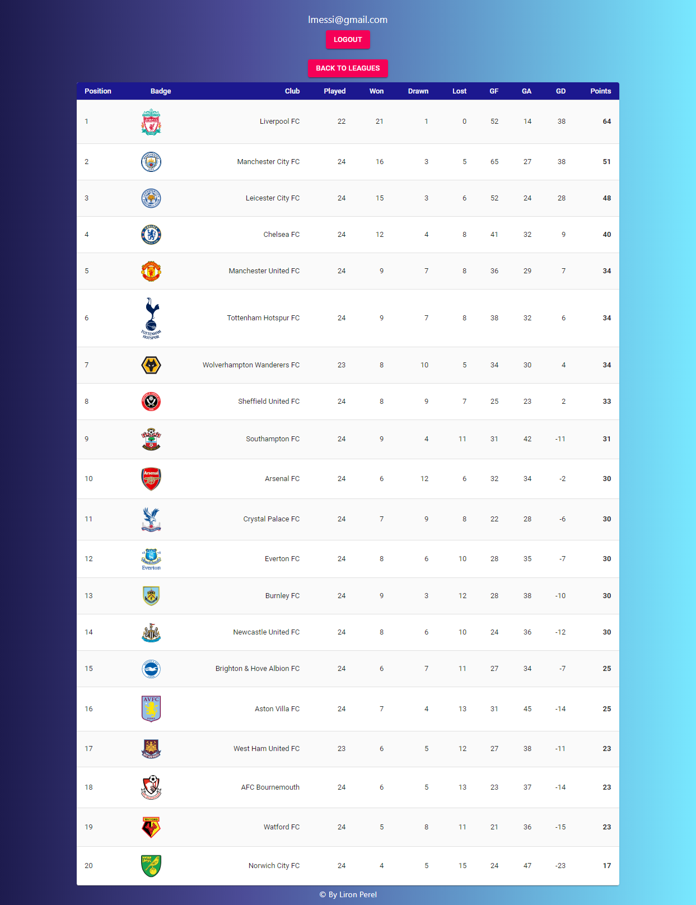

# Football-Info
> Full Stack application developed with MERN Stack
>React.js | Node.js | MongoDB | Express.js


[Working Demo](https://football-info-app.herokuapp.com/)

## Main Features
* Login/Register to application
* Main page showing 5 top football leagues
	* Premier League
	* LaLiga
	* Serie A
	* Bundesliga
	* League 1
* When choosing a league, league standing table is shown
	* Leagues data taken from https://www.football-data.org/

## Server Side Functionality
- Node.js & Express
- DB - mongoDB

* Security/Authentication
	* JWT token generated from server when logged in
	* Endpoints in server are getting JWT in request header for validation
	* Passwords are encrypted using bcrypt
* API Routes
	* Authentication
		* GET api/auth - used to check if JWT token is valid, returns User data.
		* POST api/auth - Used in login - authenticate user by email & password, returns JWT token.
	* Users
		* POST api/users - Register new user, fields validation errors supported
	* Leagues
		* GET api/leagues - returns all five leagues data

## Client side
- React.js with Material-UI
- React Context API
- Responsive UI + Mobile support






## Development setup

1. Clone
2. Run npm install on main folder (server) and client folder.
3. Set server .env file:
```sh
mongoURI = 'Your mongoDB connection string'
API_TOKEN = 'Your https://www.football-data.org/ API token'
jwtSecret = 'Any secret word you like for JWT tokens creation'
```


## Meta

Liron Perel – lironp90@gmail.com

Distributed under the MIT license.

[https://github.com/lironperel/football-info](https://github.com/lironperel/football-info)
